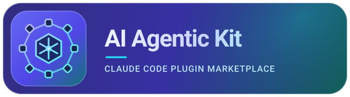

<p align="center"></p>

<p align="center"><b>Trao cho Claude Code cả một đội chuyên gia — bật đúng người cho từng project.</b></p>

<p align="center">
  
  
  
  
  
  
</p>

<p align="center"><a href="README.md">English</a> · <b>Tiếng Việt</b></p>

---

**AI Agentic Kit** biến Claude Code thành cả một đội chuyên gia: một marketplace gồm **10 plugin theo lĩnh vực** — backend, frontend, security, testing, marketing, paid-media/ads, game, viết tiếng Việt, và điều phối quy trình. Cài một lần, bật theo từng project. Không cồng kềnh, không khoá cứng — thứ gì bạn không cần thì không bật.

> **→ Thêm marketplace, bật thứ bạn cần:** `/plugin marketplace add HDShinobi/ai-agentic-kit` — rồi [chọn plugin cho project của bạn](#-cài-đặt).

## ✨ Vì sao chọn AI Agentic Kit

- **Khỏi chọn tool — đúng chuyên gia tự nhận việc.** 48 agent chuyên biệt (debugger, security-auditor, frontend-specialist, marketing-strategist, audit-google…) tự kích hoạt khi tác vụ của bạn khớp, không cần cấu hình.
- **Từ ý tưởng đến ra mắt mà không rời terminal.** 21 command workflow (`/create`, `/debug`, `/deploy`, `/audit`, `/campaign`, `/seo`) chạy trọn từng đầu việc.
- **Chỉ bật thứ một repo cần.** 10 plugin độc lập, có namespace, tự chứa — bật hai cái, phần còn lại cứ để yên; không cồng kềnh, không xung đột.
- **An toàn hơn ngay từ mặc định.** Một guard tích hợp sẵn chặn các lệnh shell phá huỷ rõ ràng nguy hiểm (xoá gốc hệ thống, format ổ đĩa, ghi raw-disk) trước khi chúng chạy.

## Mục lục

- [✨ Vì sao chọn AI Agentic Kit](#-vì-sao-chọn-ai-agentic-kit)
- [👥 Dành cho ai](#-dành-cho-ai)
- [🚀 Cài đặt](#-cài-đặt)
- [🧩 Danh mục plugin](#-danh-mục-plugin)
- [⚙️ Cơ chế kích hoạt](#️-cơ-chế-kích-hoạt)
- [🗂 Tình huống dùng command](#-tình-huống-dùng-command)
- [🛡 An toàn](#-an-toàn)
- [🧰 Phát triển](#-phát-triển)
- [📄 Giấy phép](#-giấy-phép)

## 🚀 Cài đặt

```bash
# một lần cho mỗi máy
/plugin marketplace add HDShinobi/ai-agentic-kit
# theo từng project — chỉ bật thứ bạn cần
/plugin install aak-core@ai-agentic-kit
/plugin install aak-backend@ai-agentic-kit
```

Command và skill đều được đặt **namespace** theo từng plugin — ví dụ `/aak-core:create`, `/aak-backend:deploy`. Plugin `aak-workflow` chứa các **skill** phương pháp luận quy trình (systematic-debugging, tdd-workflow, plan-writing, …) cùng phần điều phối multi-agent; **bỏ qua không cài nếu bạn đang dùng bộ `superpowers`**, vì các skill đó bao trùm cùng phạm vi. Các **command** quy trình (`/plan`, `/brainstorm`, `/debug`, `/verify`, `/test`) nằm trong các plugin `aak-core`/`aak-quality` đang hoạt động và đều tự chứa (chúng nhường cho skill `superpowers` khi có, còn không thì chạy inline).

### Cách cài khuyến nghị

**Nếu bạn đã chạy bộ [superpowers](https://github.com/obra/superpowers)** (hoặc bất kỳ bộ skill brainstorm/plan/debug/verify/test nào): cài `aak-core` + các plugin lĩnh vực bạn cần, và **KHÔNG cài `aak-workflow`**. Bạn vẫn có đủ các **command** quy trình (`/plan`, `/brainstorm`, `/debug`, `/verify`, `/test` — chúng nhường cho skill superpowers của bạn), với **không xung đột chọn skill nào**, vì các *skill* phương pháp luận trùng lặp chỉ nằm trong `aak-workflow`.

```bash
/plugin install aak-core@ai-agentic-kit          # luôn cài — nền tảng + safety hook
/plugin install aak-backend@ai-agentic-kit        # chọn các lĩnh vực bạn cần
/plugin install aak-frontend@ai-agentic-kit
/plugin install aak-marketing@ai-agentic-kit
# ...aak-security / aak-quality / aak-game khi cần
# aak-workflow: BỎ QUA (superpowers đã bao các skill phương pháp luận của nó)
```

**Nếu bạn KHÔNG chạy superpowers** và muốn một lớp quy trình tự chứa đầy đủ: cài thêm `aak-workflow` để có các skill phương pháp luận + điều phối.

> **Nguyên tắc chung:** luôn cài `aak-core` (nền tảng — và chỉ plugin này mang safety hook). Chỉ thêm `aak-workflow` **khi** bạn chưa có bộ kiểu superpowers.

Chạy dev tại chỗ mà không cần publish: `claude --plugin-dir ./plugins/aak-core`, rồi `/reload-plugins`.

## 👥 Dành cho ai

- **Người làm một mình & indie hacker** — có nguyên một đội chuyên gia mà không phải tự lắp ráp toolchain. → bắt đầu với `aak-core` + một hai lĩnh vực mà project của bạn đụng tới.
- **Lập trình viên full-stack** — đi từ scaffold → deploy → test trong cùng một terminal. → `aak-core` + `aak-backend` + `aak-frontend` + `aak-quality`.
- **Người vừa build vừa làm marketing** — ra sản phẩm *và* đưa nó ra thị trường (SEO, content, campaign, analytics). → thêm `aak-marketing`.
- **Đội coi trọng security** — đưa cả review tấn công lẫn phòng thủ vào quy trình. → thêm `aak-security`.
- **Đang dùng `superpowers`?** — tương thích hoàn toàn: cài mọi thứ trừ `aak-workflow` (các skill phương pháp luận của nó trùng với bộ của bạn), và bạn vẫn giữ được các *command* quy trình.

## 🧩 Danh mục plugin

| Plugin | Giúp gì cho bạn | Agent | Skill tiêu biểu | Command |
|--------|-----------------|-------|-----------------|---------|
| **aak-core** | Scaffold, lập kế hoạch & ra mắt app — nền tảng mà mọi project đều bật (và chỉ plugin này mang safety hook) | documentation-writer, product-manager, product-owner | app-builder, architecture, clean-code, code-review-graph, design-spec, simplify-code, i18n-localization | `/create`, `/enhance`, `/plan`, `/brainstorm` |
| **aak-backend** | Thiết kế API, mô hình hoá dữ liệu & deploy lên production với một chuyên gia cho từng phần | backend-specialist, database-architect, devops-engineer | api-patterns, database-design, nodejs-best-practices, python-patterns, rust-pro, mcp-builder, server-management, deployment-procedures | `/deploy`, `/preview` |
| **aak-frontend** | Dựng UI chỉn chu, đúng nhận diện thương hiệu cho web & mobile | frontend-specialist, mobile-developer | frontend-architecture, frontend-design, nextjs-react-expert, tailwind-patterns, web-design-guidelines, mobile-design, ui-ux-pro-max | — |
| **aak-security** | Tìm & vá lỗ hổng trước khi kẻ tấn công ra tay | security-auditor, penetration-tester | vulnerability-scanner, red-team-tactics | — |
| **aak-quality** | Bắt bug, chứng minh thay đổi chạy đúng & giữ code nhanh | debugger, test-engineer, qa-automation-engineer, performance-optimizer, code-archaeologist, explorer-agent | testing-patterns, webapp-testing, code-review-checklist, performance-profiling, lint-and-validate | `/debug`, `/verify`, `/test` |
| **aak-marketing** | Đưa sản phẩm ra thị trường — SEO/GEO, CRO, content, email, growth, analytics, brand & video (61 skill) | marketing-strategist, content-creator, growth-specialist, analytics-specialist, seo-specialist | site-audit (chấm điểm audit website), client-proposal, conversion-optimization (router CRO), page-cro, keyword-research-deep, programmatic-seo, analytics-marketing, email-marketing, content-marketing, launch-strategy, brand, vision-analysis, minimax-pdf | `/audit`, `/campaign`, `/content`, `/optimize`, `/analyze`, `/seo`, `/report`, `/brand-report` |
| **aak-ads** | Vận hành paid media như một agency — audit bám nguồn + chấm điểm tất định trên 12 nền tảng quảng cáo (Google, Meta, YouTube, LinkedIn, TikTok, Microsoft, Apple, Amazon, Reddit, Pinterest, Snapchat, X); mặc định chỉ đọc, mọi thay đổi tài khoản phải qua một mutation gate (34 skill, 25 agent) | 25 agent nền tảng/audit/creative (audit-google, audit-meta, creative-strategist, copy-writer, visual-designer, source-verifier, …) | ads (router), ads-audit, ads-plan, ads-create, ads-launch, ads-monitor, ads-optimize, ads-test, ads-report, ads-attribution, ads-server-side-tracking, ads-math, + 12 skill nền tảng | `/aak-ads:ads setup\|audit\|plan\|create\|launch\|monitor\|optimize\|experiment\|report` |
| **aak-game** | Ra game trên nhiều engine & nền tảng | game-developer | game-development (router → 10 hướng dẫn theo nền tảng) | — |
| **aak-workflow** | Quy trình bài bản — brainstorm, plan, debug, verify — cùng điều phối multi-agent (**bỏ qua nếu bạn dùng superpowers**) | project-planner | brainstorming, systematic-debugging, tdd-workflow, plan-writing, verify-changes, parallel-agents, coordinator-mode, intelligent-routing, memory-system, … | `/orchestrate`, `/coordinate`, `/status`, `/remember` |
| **aak-vietnamese** | Viết tiếng Việt (vi-VN) đạt chất lượng người bản xứ mà một dân chuyên địa phương sẽ giao — đúng register, câu chữ quảng cáo an toàn theo luật, VND/ngày tháng/Unicode sạch; kết hợp được với các skill content | — | vietnamese-landing-copy, vietnamese-business-comms, vietnamese-finance-copy, vietnamese-education-copy, vietnamese-tech-writing | — |

> **Chỉ bật thứ bạn cần.** Mỗi plugin đều tự chứa: một command không bao giờ phụ thuộc vào skill của plugin mà bạn chưa bật — nơi nào có năng lực cross-plugin phong phú hơn thì nó chỉ được dùng nếu plugin đó đã bật, còn không thì việc được làm inline.

> **`aak-ads` ↔ `aak-marketing`:** hai cái không giẫm chân nhau. `aak-marketing` vẫn là nơi chịu trách nhiệm cho organic/SEO/content/brand. Khi **bật cả hai**, `aak-ads` là hệ thống paid-media chuyên sâu và thay thế các skill tổng quát `ppc-advertising` / `ad-creative-variations` của `aak-marketing` cho mọi việc ở mức tài khoản (audit, ngân sách, launch, thay đổi trên tài khoản đang chạy) — hai skill đó có ghi chú nhường lại cho `/aak-ads:ads` khi nó hiện diện.

> **Bộ công cụ release của `aak-ads` chỉ dùng ở upstream.** `aak-ads` được vendored nguyên văn từ repo standalone [`claude-ads`](https://github.com/AgriciDaniel/claude-ads). Script `scripts/release.py` (các lệnh con `audit` / `build` / `verify`) là bộ máy release/đóng gói của repo standalone đó — nó mong đợi một repo tự chứa một-plugin (có `README.md` riêng + một `.claude-plugin/marketplace.json` tự trỏ về chính nó một-plugin), thứ mà theo thiết kế không tồn tại với một sub-plugin đã vendored. Script được giữ nguyên văn từng byte vì `scripts/verify_target_lock.py` import nó như một thư viện, nhưng phần audit qua CLI của nó **không áp dụng bên trong kit này**. Việc kiểm tra sẵn sàng release/đóng gói ở đây do marketplace chủ quản: chạy `claude plugin validate .` (marketplace) và `claude plugin validate ./plugins/aak-ads` (plugin) tại thư mục gốc của repo.

## ⚙️ Cơ chế kích hoạt

Kit cung cấp ba loại thành phần, và chúng kích hoạt theo **ba cách khác nhau** — đây là phần nhiều người hiểu sai nhất:

| Thành phần | Nằm ở | Kích hoạt thế nào | Ai kích hoạt |
|-----------|-------|-------------------|--------------|
| **Skill** (`skills/*/SKILL.md`) | mọi plugin | Claude đọc `description` của nó và nạp khi tác vụ khớp | mô hình, tự động |
| **Agent** (`agents/*.md`) | mọi plugin | Claude spawn nó thành subagent (qua Task tool) khi tác vụ khớp `description` + các từ khoá `Triggers on …` | mô hình tự động, **hoặc** một command chỉ định nó làm lead |
| **Command** (`commands/*.md`) | một số plugin | **chỉ** chạy khi bạn gõ `/plugin:command` | bạn, một cách tường minh — không bao giờ tự chạy |

### Hai cách một agent vào cuộc

- **Ngầm định (bạn chỉ trò chuyện).** Bạn mô tả một tác vụ mà không gõ command. Luồng chính (Claude) đọc `description` của mọi agent *đã bật* và, khi tác vụ của bạn khớp từ khoá, spawn agent đó thành subagent. Ví dụ: *"login API trả về 500, tìm xem sao"* khớp `debugger` (`Triggers on: bug, error, broken, investigate`) → Claude chạy `debugger` với bộ tool đọc/sửa, nó điều tra rồi báo cáo lại.
- **Tường minh (bạn chạy một command).** Command là một kịch bản workflow viết sẵn. Thân của nó chỉ định một `> **Lead agent:**` để dẫn dắt các giai đoạn, agent này rồi kéo thêm các chuyên gia khác vào. Ví dụ: `/campaign` do `marketing-strategist` dẫn dắt, agent này giao content cho `content-creator`, SEO cho `seo-specialist`, và cứ thế.

### Vòng đời một yêu cầu

```
yêu cầu của bạn / /command
        │
   [LUỒNG CHÍNH = Claude]          ← luôn ở đây; chỉ luồng chính mới spawn được subagent
        │
   ┌────┴───────────────────────────────┐
   │ không có command:                  │ có /command:
   │ khớp một skill/agent theo          │ đọc workflow trong thân command,
   │ description → tự nạp / tự spawn     │ giao việc theo "Lead agent" của nó
   └────┬───────────────────────────────┘
        │
   spawn subagent qua Task tool  (một subagent KHÔNG spawn thêm subagent được — chỉ một cấp)
        │  mỗi agent = context riêng + một bộ tool giới hạn (vd product-manager không có Write)
        │
   subagent trả về → LUỒNG CHÍNH tổng hợp → trả lời bạn
```

Từ đây rút ra hai quy tắc mang tính cấu trúc: **subagent chỉ sâu một cấp** (một agent không gọi được agent khác — phối hợp multi-agent luôn chạy ở luồng chính hoặc qua `/orchestrate`), và mọi command tuân theo **quy tắc suy giảm** — *giao cho một chuyên gia nếu plugin của nó đã bật, còn không thì tự đảm nhận vai trò đó inline* — nên một command không bao giờ rỗng kể cả khi bạn mới chỉ bật `aak-core`.

## 🗂 Tình huống dùng command

Mỗi command là một workflow riêng biệt với một mốc "dùng khi" rõ ràng. Chúng cũng nối chuỗi được: `/campaign` gọi `/content` cho từng tài sản, rồi giao phần đo lường cho `/analyze` → `/report`.

### Nhánh Dev

| Command | Dùng khi | Lead / cơ chế |
|---------|----------|---------------|
| `/aak-core:create` | bắt đầu một app hoàn toàn mới | skill `app-builder` → khoanh vùng phạm vi → `DESIGN.md` → build |
| `/aak-core:enhance` | thêm/đổi một tính năng trong app đã có | lặp dần, không scaffold lại |
| `/aak-core:plan` | bạn chỉ muốn một **file kế hoạch** (chia nhỏ đầu việc), chưa code | `project-planner`, chỉ lập kế hoạch |
| `/aak-core:brainstorm` | chưa rõ hướng đi — so nhiều cách tiếp cận trước đã | nhường cho `superpowers`/`brainstorming` |
| `/aak-backend:deploy`, `/preview` | release lên production / server dev tại chỗ | `devops-engineer`, có kiểm tra pre-flight |
| `/aak-quality:debug` | một bug khó — **tìm root-cause trước khi sửa** | `systematic-debugging`, dựa trên bằng chứng |
| `/aak-quality:test`, `/verify` | sinh & chạy test / chứng minh thay đổi thật sự chạy được | `test-engineer` |
| `/aak-workflow:orchestrate`, `/coordinate` | một tác vụ lớn cần **3+ góc nhìn chuyên gia** song song | luồng chính spawn nhiều agent |

### Nhánh Marketing (`aak-marketing`)

#### Vòng lặp kiếm tiền kiểu agency

Các command audit/report không phải công cụ đứng lẻ — chúng đóng khung một vòng đầy đủ **audit → đề xuất → thực thi → chứng minh → bàn giao**, đúng cách một agency thật sự tính tiền:

```
/aak-marketing:audit <url>   → điểm 0–100 + MARKETING-AUDIT.md (có ngày, giữ làm lịch sử)
        → client-proposal      (phát hiện → một proposal đã báo giá)
        → 40+ skill giao việc   (copy / email / CRO / SEO … làm phần việc thật)
        → /aak-marketing:audit  (chạy lại) → DELTA trước/sau   ← bằng chứng của cải thiện
        → /report               (PDF sẵn sàng giao khách)
```

Phần audit chạy trên một mô hình chấm điểm cố định, minh bạch (**rubric, trọng số và định dạng báo cáo**), và giữ một **lịch sử audit có ngày** để một lần chạy lại tạo ra **delta trước/sau** — bạn có thể *chứng minh* phần cải thiện mà mình được trả tiền, rồi giao khách một file PDF.

**Command vòng-lặp-agency** — chạy vòng lặp bên trên:

| Command | Dùng khi | Lead / cơ chế |
|---------|----------|---------------|
| `/audit` | chấm điểm marketing của một site (content, CRO, SEO/GEO, brand, cạnh tranh, growth) → một báo cáo có ngày; chạy lại để có delta trước/sau | `marketing-strategist` |
| `/report` | xuất kết quả thành một **PDF** sẵn sàng giao khách | tool xuất bản (`minimax-pdf`) |
| `/brand-report` | vẫn xuất PDF đó, nhưng **clone phong cách site của một brand** từ một URL trước | tool xuất bản (`minimax-pdf`) |

**Command thực thi marketing** — làm phần việc thật:

| Command | Dùng khi | Lead agent |
|---------|----------|-----------|
| `/campaign` | một **campaign đầy đủ** từ đầu đến cuối: brief → chiến lược → content → launch → tối ưu | `marketing-strategist` |
| `/content` | một tài sản đơn: brief → nghiên cứu → dàn ý → viết → tối ưu | `content-creator` |
| `/optimize` | nâng tỷ lệ chuyển đổi (CRO) cho một trang/funnel | `growth-specialist` + router CRO |
| `/analyze` | xử lý số liệu, tìm insight, đề xuất hành động | `analytics-specialist` |
| `/seo` | audit/tối ưu SEO + GEO (gồm cả khả năng hiển thị trên AI-search) | `seo-specialist` |

## 🛡 An toàn

`aak-core` cung cấp một hook `PreToolUse` native (`hooks/guard.mjs`) chặn một tập hẹp các lệnh Bash phá huỷ chắc-chắn-nguy-hiểm (xoá gốc hệ thống, format ổ đĩa, ghi raw-disk — gồm cả macOS `/dev/rdisk*`). Nó cố ý giữ phạm vi hẹp và neo lệnh theo vị trí, nên những chỗ chỉ nhắc tới như `echo "rm -rf /"` sẽ không bị chặn. Đây không phải là một linter tổng quát.

> **Cài `aak-core` trong mọi project.** Đây là plugin nền tảng và chỉ mình nó cung cấp safety hook — bật các plugin khác mà thiếu nó thì Bash không được kit này bảo vệ.

## 🧰 Phát triển

- Validate: `claude plugin validate ./plugins/aak-<name>` (và `claude plugin validate .` cho marketplace).
- Test safety-hook: `node --test plugins/aak-core/hooks/guard.test.mjs`.
- Bộ chuyển đổi migration (một lần, để tái tạo lại từ nguồn): `scripts/convert.mjs` + `scripts/mapping.mjs`.

> Được xây dựng dựa trên và ghi công các dự án mã nguồn mở trước đó — xem [NOTICE](NOTICE) để biết ghi công đầy đủ.

## 📄 Giấy phép

MIT. Xem [LICENSE](LICENSE) (ở gốc và theo từng plugin).
